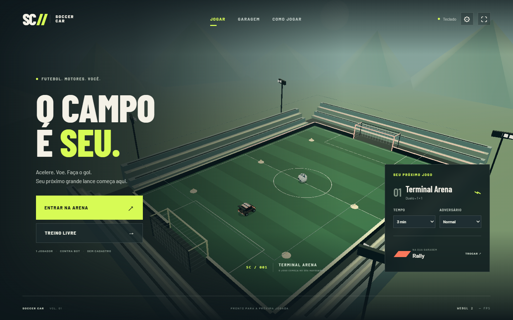

# Soccer Car

Futebol arcade com carros, feito para abrir o navegador e jogar. Projeto pessoal de **Enzo Faroni Zon**, desenvolvido com TypeScript, Three.js, HTML e CSS.

[Jogar no navegador](https://enzozon.github.io/soccer-car/) · [Código e histórico](https://github.com/enzozon/soccer-car) · [Verificações](https://github.com/enzozon/soccer-car/actions)



## O jogo

- **Duelo 1 × 1 contra bot**, com três dificuldades, partidas de 1, 3 ou 5 minutos e gol de ouro no empate.
- **Treino livre**, com turbo ilimitado e reposicionamento da bola e do carro.
- **Garagem** com Pulse, Rally e Vector: modelos próprios com diferenças de aceleração, velocidade e direção, além de cinco pinturas.
- Aceleração, ré, turbo, salto duplo, derrapagem, colisões e recarga de turbo nos pontos da arena.
- Câmeras atrás do carro, seguindo a bola e visão geral.
- Teclado, controles com mapeamento padrão da Gamepad API e botões de toque.
- Gráficos automáticos, econômico, alto e **fallback Canvas 2D**, usando a mesma simulação.
- Preferências locais, sons sintetizados, pausa ao perder foco e opção para reduzir movimento da câmera.

É uma experiência local para um jogador. Não inclui multiplayer online, física profissional de veículos, wall riding nem os modelos de Rocket League. O código, a arena e as carrocerias são próprios; veja [origem e licenças](docs/ORIGEM.md).

## Executar localmente

Use Node.js **24 LTS** e npm. Não há backend, conta, chave de API ou banco de dados para configurar.

```bash
git clone https://github.com/enzozon/soccer-car.git
cd soccer-car
npm ci
npm run dev
```

Abra o endereço mostrado pelo Vite. Para gerar e conferir os arquivos estáticos:

```bash
npm run build
npm run preview
```

Sirva a pasta `dist/` por HTTP(S). Abrir `index.html` diretamente por `file://` não é suportado. O build usa caminhos relativos e pode ser hospedado em uma subpasta, como o GitHub Pages.

## Controles

| Ação                   | Teclado        | Controle padrão    |
| ---------------------- | -------------- | ------------------ |
| Acelerar / ré          | W / S ou ↑ / ↓ | RT / LT            |
| Dirigir                | A / D ou ← / → | Analógico esquerdo |
| Turbo                  | Shift          | B / ○              |
| Salto / segundo salto  | Espaço         | A / ×              |
| Derrapar               | Ctrl           | X / □              |
| Trocar câmera          | C              | Y / △              |
| Pausar                 | Esc / P        | Start / Options    |
| Reposicionar no treino | R              | Back / Share       |

Conecte o controle e pressione um botão com a página em foco. Alguns navegadores só expõem o dispositivo após essa interação. Ajuste a zona morta se houver movimento involuntário. Teclado e toque continuam disponíveis quando a Gamepad API não é suportada ou está bloqueada. O suporte depende do navegador, do sistema e do mapeamento do controle; dispositivos físicos precisam de validação no computador do jogador.

## Compatibilidade e desempenho

O objetivo é atender computadores modestos e navegadores modernos; não há garantia de funcionamento em literalmente qualquer hardware ou navegador antigo. O modo 3D requer WebGL 2. Sem esse recurso, o jogo usa Canvas 2D, que também pode ser escolhido nas configurações.

- Física com passo fixo de 1/120 s e no máximo oito passos por quadro, para limitar trabalho acumulado.
- Modelos geométricos leves; sem download de texturas, modelos de terceiros ou arquivos de áudio.
- Resolução limitada por perfil gráfico e ajuste automático durante quedas de desempenho.
- Atualização do HUD a 10 Hz e renderização interrompida quando a página está oculta.
- Three.js carregado separadamente; o modo 2D evita carregar o motor 3D.
- Fontes hospedadas junto do jogo, sem requisições a Google Fonts durante a partida.

Consulte [validação e limites](docs/VALIDACAO.md) para os testes realizados e como reproduzi-los. O contador de FPS mostra o desempenho do dispositivo atual.

## Verificar

```bash
npm run check
npx playwright install chromium firefox webkit
npm run test:browser
npm run benchmark
```

Os testes unitários usam `node:test`. Os testes de navegador exercitam garagem, persistência, movimentação, câmera, pausa, teclado, gamepad simulado e layout/toque em Chromium, Firefox e WebKit. A CI executa essas verificações; o workflow de publicação disponibiliza a versão aprovada no GitHub Pages.

## Estrutura

```text
src/
  simulation.ts   Física, bot, gols e ciclo de partida
  input.ts        Teclado, Gamepad API e toque
  renderer.ts     Arena e carros em Three.js
  renderer2d.ts   Alternativa Canvas 2D
  main.ts         Menu, garagem, HUD e loop do jogo
  settings.ts     Validação e persistência local
  audio.ts        Efeitos sintetizados com Web Audio
tests/            Simulação, entrada, preferências e navegadores
```

Entrada, simulação e renderização são independentes: os dois renderizadores consomem o mesmo estado. Isso permite testar as regras sem GPU e manter o modo compatível com o mesmo comportamento de partida.

Licença [MIT](LICENSE). Fontes Barlow sob [SIL OFL 1.1](public/fonts/OFL.txt).
